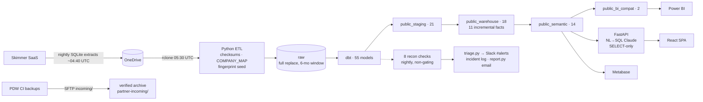
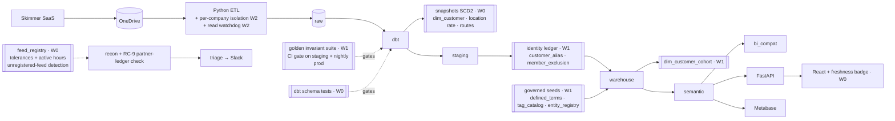
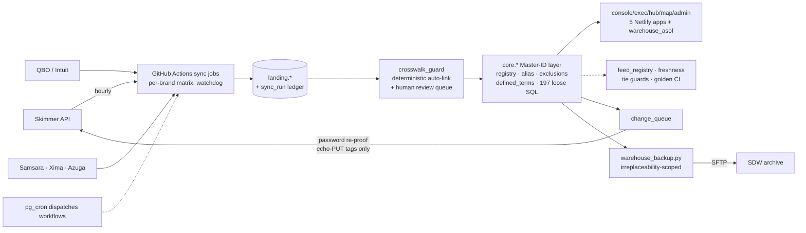
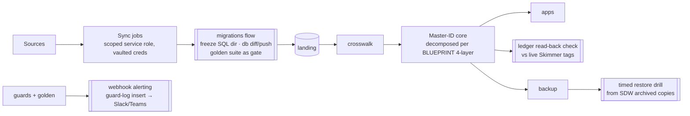

# SDW & PDW — Current → Future State Architecture

**2026-08-10 · Pattern Study Phase F** · Companions: `docs/pattern-study/phase-a…e`. PDW future state is advisory only (see `pdw-advisory-briefing.md`); SDW future state is the proposed Wave 0–2 plan pending Ross's PR approval.

---

## 1. SDW — Current State

**Spine (keep):** dbt + PR + branch-per-stream · triage→Slack alerting · audit-schema isolation + PII retention · CF Access everywhere · registry-driven onboarding (COMPANY_MAP) · partner SFTP custody chain.

**Gaps (fix):** zero dbt tests, nothing gates a merge · no dimension history (SCD0 rebuild + 6-mo window = silent erasure) · no identity above (id, company) · no feed registry · semantics unversioned · no UI freshness signal.

## 2. SDW — Future State (Waves 0–2)

**Delta summary:** the assertion layer arrives (tests W0, invariants W1, tie-outs inside golden scope), history stops being destroyed (snapshots W0 — the clock item), identity + semantics become governed data (W1 chain: ledger → seeds → cohort dim), monitoring becomes complete (feed registry W0, gates all new sources), and the serving layer becomes honest (freshness badge W0). ETL-9 (full schema governance, L) lands after, consuming DL-21/22 as down-payments.

## 3. PDW — Current State (observed, read-only)

**Keep:** the entire assertion/governance layer · identity machinery · ingestion robustness · irreplaceability-scoped backup.
**Gaps:** no migrations/environments (197 hand-applied files, documented drift) · guards page nobody · mgmt-token as routine SQL path + creds custody · monolithic canonical view vs their own BLUEPRINT layering · locked ledger without read-back (1,272-row drift).

## 4. PDW — Future State (advisory)

All four insertions (migrations, alerting, read-back, drill) are additive — none disturb the working assertion layer. Sequencing logic mirrors ours inverted: their cheapest high-value fix is alerting (days); their compounding one is migrations.

## 5. The exchange, one table

| Pattern | Direction | Vehicle |
|---|---|---|
| Golden invariants / tie guards | PDW → SDW | DL-22 |
| feed_registry + schedule-aware freshness | PDW → SDW | ETL-10 |
| defined_terms / charter / tag_catalog | PDW → SDW | DL-25 |
| Identity ledger (alias + exclusions) | PDW → SDW | DL-24 |
| warehouse_asof freshness stamp | PDW → SDW | DA-6 |
| SCD/episode history discipline | PDW → SDW | DL-23 |
| Per-brand isolation + watchdog | PDW → SDW | ETL-11 |
| Triage → Slack alerting | SDW → PDW | advisory #2 + code offer |
| dbt/PR/migrations discipline | SDW → PDW | advisory #1 + walkthrough |
| Custody archiving + verification | SDW → PDW | already running (their backups, our archive) |
| Ledger read-back reconciliation | both | RC-9 (ours) · advisory #4 (theirs) |

## 6. Invariants that do not change

- **PDW = Pool Deck (Sam/AQPN, Supabase) · SDW = Splashworks (Ross/CCE, this repo).** Contamination boundary: `SUPABASE_*` vs `DATABASE_URL`.
- **No PDW data is ingested into SDW models** — governance backups are held as verified files (custody), and RC-9 reads them for *reconciliation*, never for modeling.
- **AQPN org: Lex Immutabilis** — local review only; advisory changes are Sam's to make.
- **SDW stays read-only toward Skimmer** — no write-back adoption.
